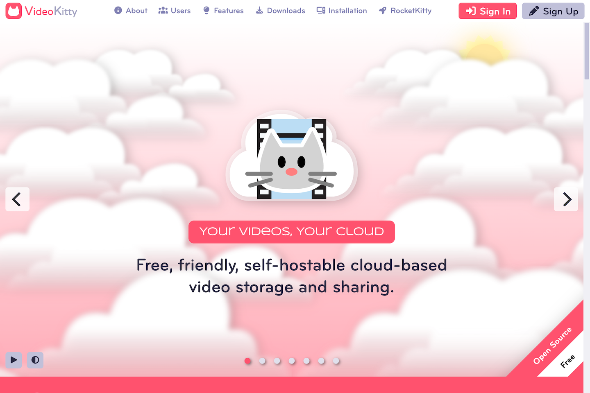
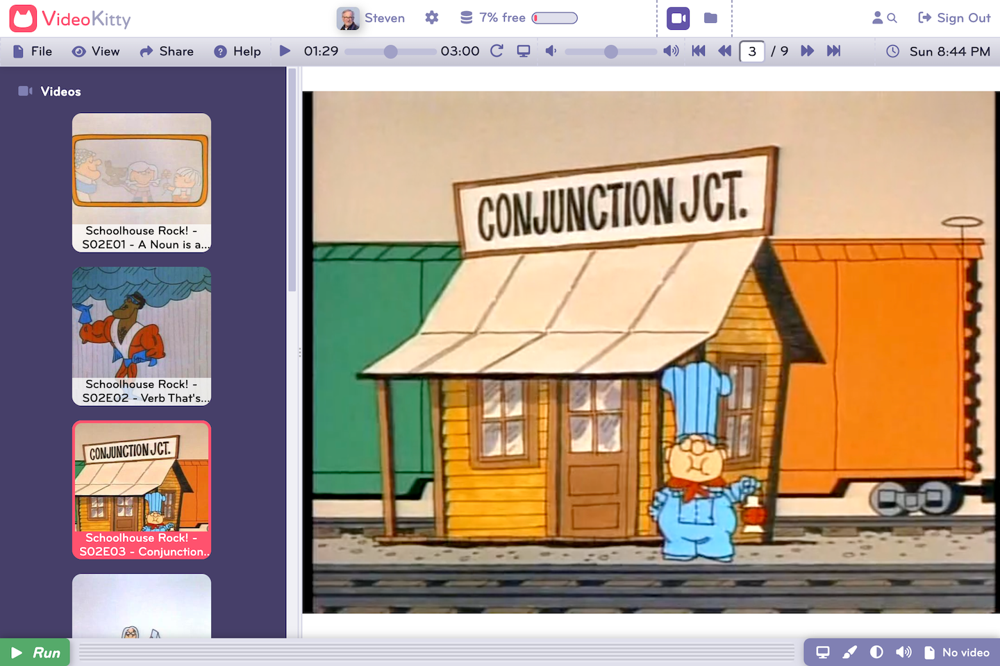

	

# VideoKitty

VideoKitty is a cloud-based photo management and sharing system that makes organizing and sharing your videos easy. Best of all, you can run on your own server!

Welcome Screen

Desktop

## Features

- Video sharing - share by link, shared folder, or email.
- Map viewer - view geolocated videos on a map.
- Easy to install - with a one-step Docker installation.
- Easy to use - works like the desktop and mobile systems you already know.
Customizable - by users and site administrators.
Platform independent - desktop or mobile.
Self-hostable - run on your own server.

## Benefits

- Easily share videos with friends, family, or colleagues.
- Revisit your memories and explore your videos.
- Set up is quick and painless.
- Spend your time using instead of learning how to use the platform.
- Personalize your VideoKitty user experience.
- Run on any connected device.
- Take back control over your data from the tech giants.

## Live Demo

You can create an account and explore the features and benefits of the platform at [videokitty.org](https://videokitty.org).

## Installation

Please follow the instructions in [vidieokitty.org/#installation](https://videokitty.org/#installation) to install the software on your computer or web server.

## Instructions

See the [VideoKitty User Guide](https://videokitty.org/#help) for instructions on how to use the platform.

## License

Distributed under the <a href="https://en.wikipedia.org/wiki/MIT_License">MIT License</a> which allows unrestricted use of the software. See [LICENSE](LICENSE) for more information.

## Contact

mailto:admin@videokitty.org
